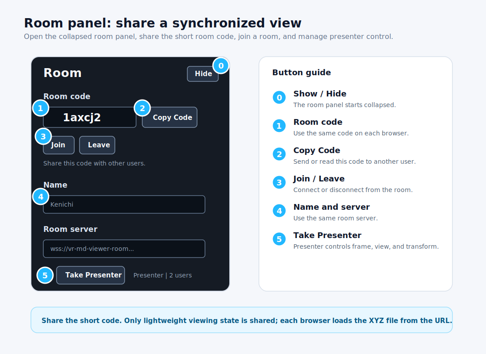

# GEARS XR

GEARS XR (Extended Reality) is a browser-based molecular dynamics trajectory viewer for extended XYZ files, with desktop controls and WebXR support for virtual reality headsets.

[Open the viewer](https://gearsxr.space/)


## Features

- Load extended XYZ trajectories from a local file, drag-and-drop, or URL.
- Play multi-frame trajectories with a separate frame slider, step buttons, and FPS control panel.
- Color atoms by element and update atom types correctly on each frame.
- Compute bonds per frame from covalent radii.
- Choose bundled 360-degree VR backgrounds, with high-contrast dark cyberspace as the default.
- Collapse the control panel to keep more of the scene visible.
- Enter VR through WebXR when the browser and headset support it.
- Grab, move, and scale the molecule with VR controllers.
- Select atoms to measure distances and angles.
- Join a lightweight multiuser room to share trajectory URL, frame, playback, and view state.

## Window Layout

GEARS XR opens with the molecule scene in the center, the main loading panel at the top-left, the **Enter VR** button at the top-right, the playback panel at the bottom-left after a trajectory is loaded, and the room panel at the bottom-right.


The room panel is collapsed by default. Click **Show** in the bottom-right **Room** panel when you want to join or share a multiuser room.

## Try the Demo

1. Open the hosted viewer:

   [https://gearsxr.space/](https://gearsxr.space/)

2. The URL field is prefilled with the bundled demo trajectory:

   ```text
   https://gearsxr.space/samples/tobe.xyz
   ```

3. Click **Load URL**.
4. Use the bottom-left playback panel's frame slider, **Play**, step buttons, and **FPS** field to inspect the trajectory.
5. Choose a **Background** if you want a different VR room environment.
6. Click **Hide** to collapse the controls and leave more space for the molecule.

The default background is **Dark Cyberspace**, which keeps atom colors easy to see.


## Main Panel: Load Files And Backgrounds

Use the top-left main panel to load trajectories and choose the visual background.


The viewer supports standard XYZ and extended XYZ trajectory files:

```text
natoms
comment or Properties=...
Element x y z ...
Element x y z ...
```

For extended XYZ files, the parser reads `Properties=...` metadata to find species, position, and atom-ID columns. When atom IDs are present, each frame is reordered to the first frame's ID order so atom identity stays stable across the trajectory. Atom types are stored per frame, so color and bond-radius logic follow the current frame rather than only the first frame.

There are three ways to load a file:

- Click **Choose File** and select a local `.xyz` file.
- Drag and drop a `.xyz` file onto the page.
- Paste a direct file URL into **Or load from a URL**, then click **Load URL**.

For single-user viewing, all three methods work. For multiuser rooms, use **Load URL** because local files are not sent to other users.

Use **Background** to switch between bundled 360-degree VR backgrounds. Use **Hide** to collapse the main panel and **Show** to reopen it.

## Playback Panel: Frames, Play, And FPS

The playback panel appears at the bottom-left after a trajectory loads.


- Drag the frame slider to inspect a specific frame.
- Click **Play** to animate the trajectory; the button becomes **Pause** while playing.
- Click **<** or **>** to step backward or forward one frame.
- Type a number in **FPS** to change playback speed.

In a multiuser room, only the presenter can control playback. Followers receive the presenter's frame, play/pause state, and FPS.

## Room Panel: Multiuser Viewing

Multiuser rooms synchronize lightweight viewing state. Each user renders the molecule locally, while the room shares the trajectory URL, frame, play/pause state, FPS, background, presenter, molecule transform, and desktop camera view.



1. Open the hosted viewer.
2. Load a trajectory with **Load URL**.
3. Click **Show** in the bottom-right **Room** panel.
4. In the **Room code** field, keep the generated code or type your own short code.
5. Type your display name in **Name**.
6. Keep the default deployed room server. Other users should use the same server:

   ```text
   wss://vr-md-viewer-room.kenichi-nomura.workers.dev
   ```

7. Click **Join**.
8. Click **Copy Code** and send or read the short room code to another user.
9. The other user opens GEARS XR, clicks **Show** if needed, types the same room code, and clicks **Join**.

The first user in the room becomes the presenter. The presenter controls playback, FPS, background, molecule position, molecule rotation, molecule scale, and desktop camera view. Other users follow the presenter.

To transfer control, another user clicks **Take Presenter**.

## Use a Custom XYZ File in a Room

For everyone in a room to see the same trajectory, the file must be reachable by every browser.

Good options:

- A file hosted on GitHub Pages.
- A direct HTTPS file URL from a web server.
- A public file URL with browser-accessible CORS headers.

Avoid using **Choose File** for a room demo. Local file loading only affects your own browser, so other room members will wait for a trajectory URL.

## VR And Measurements

Use the **Enter VR** button at the top-right for headset viewing. Measurements work on desktop and in VR.


VR requires a WebXR-compatible browser and a secure HTTPS page.

1. Open the hosted viewer in a WebXR browser, such as Quest Browser.
2. Load the demo trajectory or another URL-based XYZ trajectory.
3. Click **Enter VR** in the top-right corner.
4. Use VR controllers to grab, move, and scale the molecule.
5. Select atoms in VR to measure distances and angles.

If **Enter VR** does not appear, the current browser or device is not exposing an `immersive-vr` WebXR session to the page.

On desktop, click atoms to measure. Selecting two atoms reports a distance; selecting three atoms reports an angle. Press `c` to clear measurements.

## Quick Troubleshooting

- **Room stays on Connecting:** check that the room server starts with `wss://` on the hosted HTTPS page.
- **Other users do not see my molecule:** load the trajectory with **Load URL**, not **Choose File**.
- **A follower cannot control the scene:** click **Take Presenter** first.
- **FPS does not change for followers:** only the presenter can change shared FPS.
- **VR button says not supported:** use a WebXR-compatible headset browser over HTTPS.

## License

MIT License. See [LICENSE](LICENSE).
